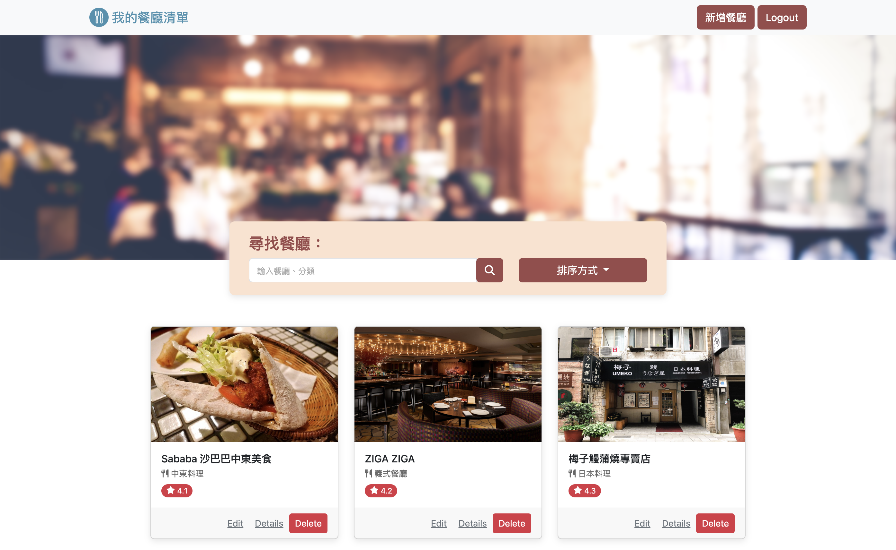

# 我的餐廳清單

## 功能
- 瀏覽所有餐廳
- 查看餐廳的詳細資訊
- 連結餐廳地址到 Google 地圖
- 搜尋餐廳
- 新增餐廳
- 修改餐廳
- 刪除餐廳

## 開始使用
1. 請先確認本地端有安裝 Node.js 及 npm

2. 將專案 git clone 至本地端

3. 開啟終端機移動至專案資料夾

`cd <專案資料夾位置>`

4. 安裝需要的套件

`npm install`

5. 安裝完成後，設定環境變數，連線 MongoDB

`MONGODB_URI=mongodb+srv://<Your MongoDB Account>:<Your MongoDB Password>@cluster0.xxxx.xxxx.net/<Your MongoDB Table>?retryWrites=true&w=majority`

6. 執行專案

`npm run start`

7. 若出現此訊息表示執行順利，在瀏覽器輸入以下網址開始使用

`App is running on http://localhost:3000
mongodb connected!`

8. 如果要暫停使用，請在終端機輸入以下指令，並關閉瀏覽器

`ctrl + c`

9. 如有需要生成種子資料請輸入以下指令

`npm run seed`

## 開發工具
- Node.js ^14.16.0
- Nodemon
- Express ^4.18.2
- Express-handlebars ^3.0.0
- MongoDB
- mongoose ^5.13.15
- dotenv ^16.0.3
- method-override ^3.0.0
- Bootstrap
- Font-awesome